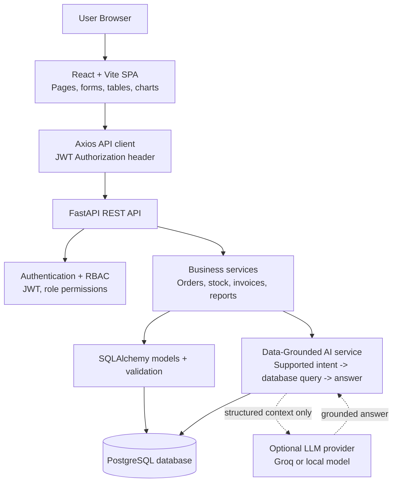
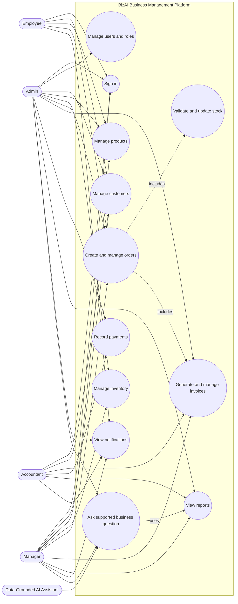
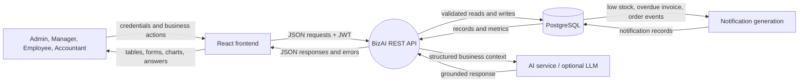
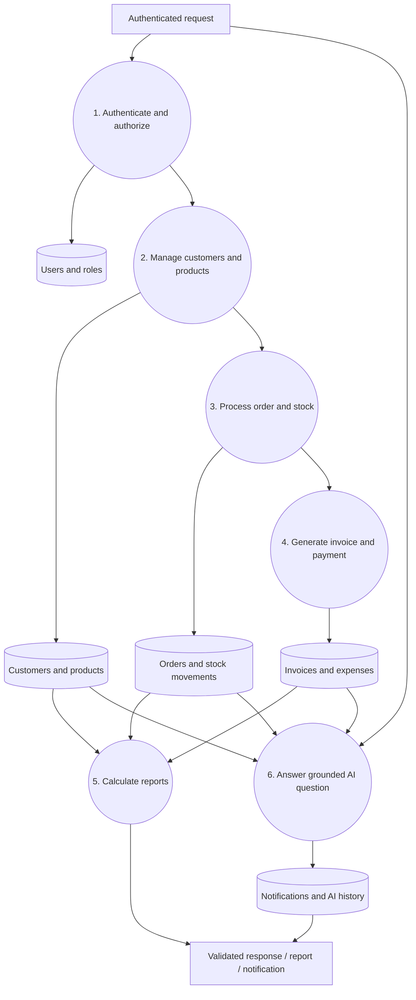
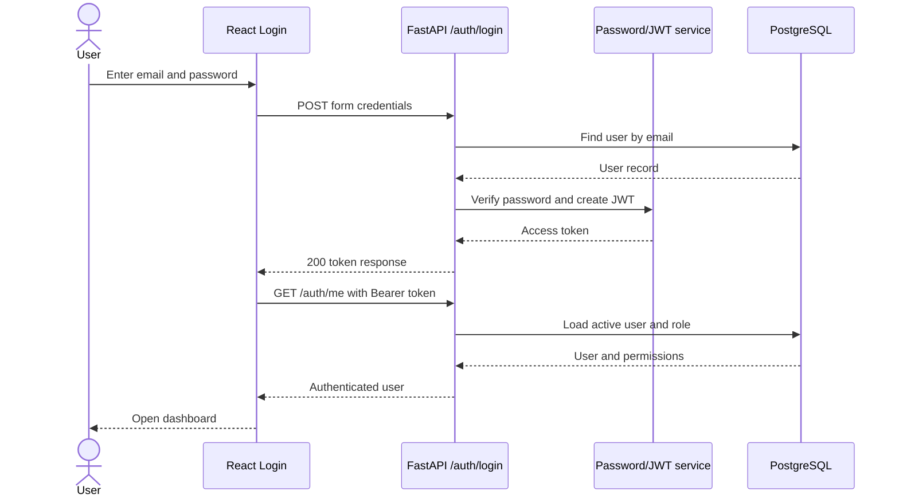
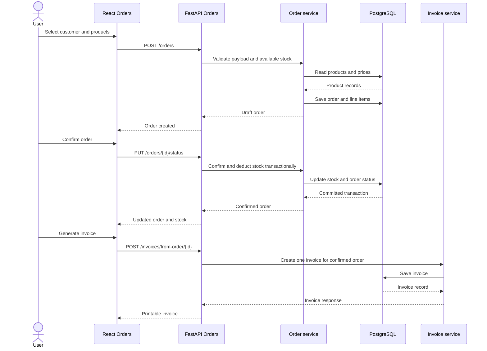
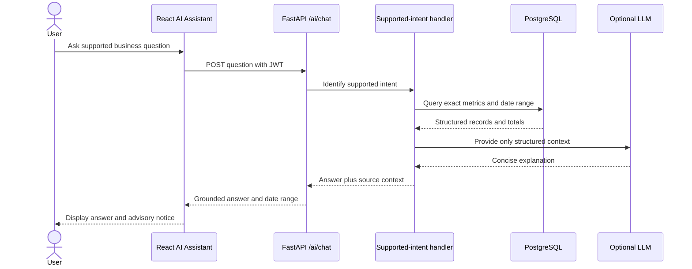
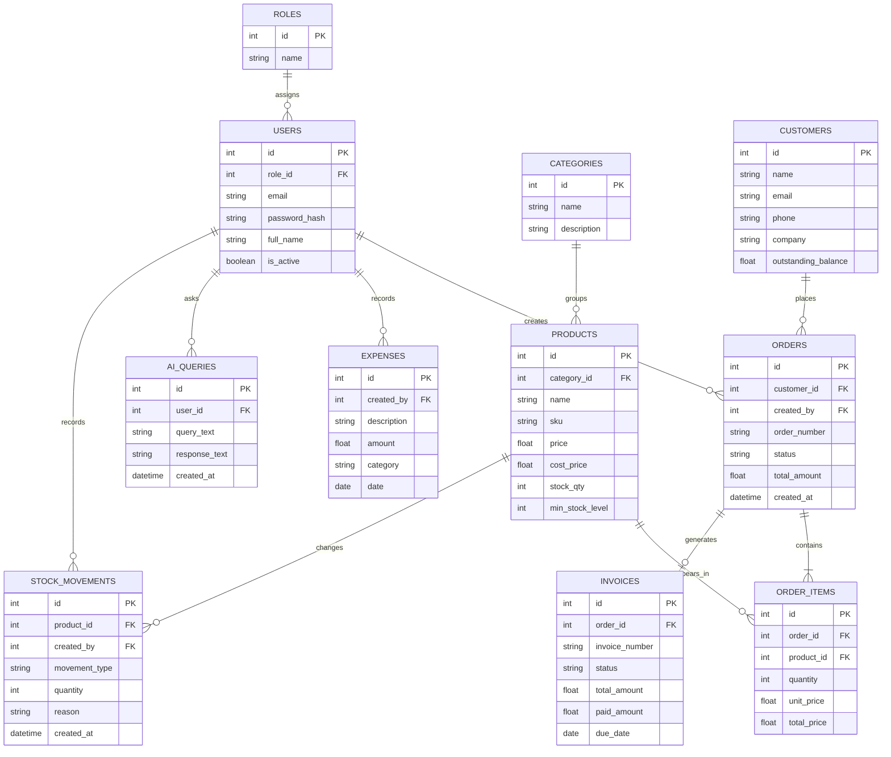
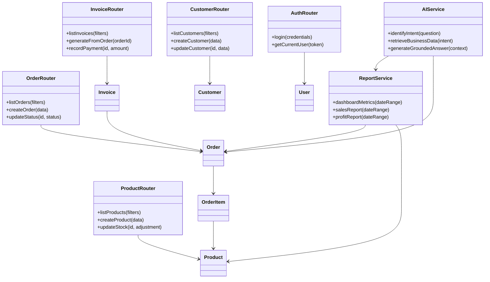

# BizAI – Project Architecture & Planning Document

---

## A. Overall Project Architecture

```
┌─────────────────────────────────────────────────────────┐
│                      BROWSER                            │
│              React.js SPA (Vite)                        │
│    ┌──────────┬──────────┬──────────┬─────────┐         │
│    │Dashboard │Customers │ Orders   │AI Chat  │  ...    │
│    └────┬─────┴────┬─────┴────┬─────┴────┬────┘         │
│         │          │          │          │               │
│         └──────────┴──────────┴──────────┘               │
│                     Axios HTTP Client                    │
└────────────────────────┬────────────────────────────────┘
                         │  REST API (JSON)
                         ▼
┌─────────────────────────────────────────────────────────┐
│                    FastAPI Backend                       │
│  ┌──────────────────────────────────────────────────┐   │
│  │  Auth Middleware (JWT)  │  CORS  │  Rate Limiter │   │
│  └──────────────────────────────────────────────────┘   │
│  ┌──────────────────────────────────────────────────┐   │
│  │              API Router Layer                     │   │
│  │  /auth  /users  /customers  /products  /orders   │   │
│  │  /invoices  /inventory  /reports  /ai             │   │
│  └──────────────────────────────────────────────────┘   │
│  ┌──────────────────────────────────────────────────┐   │
│  │           Service / Business Logic Layer          │   │
│  │  AuthService  CustomerService  OrderService ...   │   │
│  └──────────────────────────────────────────────────┘   │
│  ┌──────────────────────────────────────────────────┐   │
│  │              Data Access Layer (SQLAlchemy)        │   │
│  │              Models / Repositories                │   │
│  └──────────────────────────────────────────────────┘   │
│  ┌──────────────────────────────────────────────────┐   │
│  │           AI Service Layer (Pluggable)            │   │
│  │  AIProvider interface → Groq / Ollama / OpenAI    │   │
│  └──────────────────────────────────────────────────┘   │
└────────────────────────┬────────────────────────────────┘
                         │
                         ▼
┌─────────────────────────────────────────────────────────┐
│                    PostgreSQL                            │
│  Users, Roles, Customers, Products, Categories,         │
│  Inventory, Orders, OrderItems, Invoices, Expenses,     │
│  AIQueryHistory                                         │
└─────────────────────────────────────────────────────────┘
```

### Key Architectural Decisions

1. **PostgreSQL over MySQL** — Better JSON support (for AI query logs), stronger data integrity features, free tier on platforms like Supabase/Render/Railway for deployment.

2. **Vite over CRA** — Faster dev server, smaller bundles, better DX. React + Vite is the modern standard.

3. **SQLAlchemy ORM** — Industry standard Python ORM, excellent with FastAPI. Prevents raw SQL injection, provides migration support via Alembic.

4. **JWT Authentication** — Stateless, simple, works well with REST APIs. Access token (15 min) + Refresh token (7 days).

5. **Groq (free tier) as default AI provider** — Extremely fast inference, free tier generous enough for a college project. The AI layer is abstracted so any LLM provider can be swapped in.

---

## B. Complete Module Breakdown

### Backend Modules

```
backend/
├── main.py                    # FastAPI app entry point
├── config.py                  # Settings & env vars (pydantic-settings)
├── database.py                # DB connection & session
├── requirements.txt
│
├── models/                    # SQLAlchemy ORM models
│   ├── user.py
│   ├── customer.py
│   ├── product.py
│   ├── category.py
│   ├── order.py
│   ├── order_item.py
│   ├── invoice.py
│   ├── expense.py
│   └── ai_query.py
│
├── schemas/                   # Pydantic request/response schemas
│   ├── user.py
│   ├── customer.py
│   ├── product.py
│   ├── order.py
│   ├── invoice.py
│   ├── expense.py
│   └── report.py
│
├── routers/                   # API route handlers
│   ├── auth.py
│   ├── users.py
│   ├── customers.py
│   ├── products.py
│   ├── inventory.py
│   ├── orders.py
│   ├── invoices.py
│   ├── reports.py
│   └── ai.py
│
├── services/                  # Business logic
│   ├── auth_service.py
│   ├── customer_service.py
│   ├── product_service.py
│   ├── inventory_service.py
│   ├── order_service.py
│   ├── invoice_service.py
│   ├── report_service.py
│   └── ai_service.py
│
├── middleware/                 # Auth, CORS, logging
│   ├── auth.py
│   └── logging.py
│
├── utils/                     # Helpers
│   ├── security.py            # Password hashing, JWT
│   ├── permissions.py         # Role-based access decorators
│   └── pdf.py                 # Invoice PDF generation
│
└── migrations/                # Alembic migrations
    └── versions/
```

### Frontend Modules

```
frontend/
├── index.html
├── vite.config.js
├── package.json
│
├── public/
│   └── favicon.ico
│
└── src/
    ├── main.jsx               # Entry point
    ├── App.jsx                # Root component + routes
    │
    ├── api/                   # Axios instances & API calls
    │   ├── client.js          # Axios config with interceptors
    │   ├── auth.js
    │   ├── customers.js
    │   ├── products.js
    │   ├── orders.js
    │   ├── invoices.js
    │   ├── reports.js
    │   └── ai.js
    │
    ├── components/            # Reusable UI components
    │   ├── layout/
    │   │   ├── Sidebar.jsx
    │   │   ├── TopBar.jsx
    │   │   └── Layout.jsx
    │   ├── common/
    │   │   ├── DataTable.jsx
    │   │   ├── Modal.jsx
    │   │   ├── SearchBar.jsx
    │   │   ├── StatusBadge.jsx
    │   │   ├── StatCard.jsx
    │   │   ├── ChartCard.jsx
    │   │   ├── AlertBanner.jsx
    │   │   └── ConfirmDialog.jsx
    │   └── forms/
    │       ├── CustomerForm.jsx
    │       ├── ProductForm.jsx
    │       ├── OrderForm.jsx
    │       └── UserForm.jsx
    │
    ├── pages/                 # Page-level components
    │   ├── Login.jsx
    │   ├── Dashboard.jsx
    │   ├── Customers.jsx
    │   ├── CustomerDetail.jsx
    │   ├── Products.jsx
    │   ├── ProductDetail.jsx
    │   ├── Inventory.jsx
    │   ├── Orders.jsx
    │   ├── OrderDetail.jsx
    │   ├── Invoices.jsx
    │   ├── InvoiceDetail.jsx
    │   ├── Reports.jsx
    │   ├── AIAssistant.jsx
    │   ├── Users.jsx
    │   └── Settings.jsx
    │
    ├── context/               # React Context for global state
    │   ├── AuthContext.jsx
    │   └── ThemeContext.jsx
    │
    ├── hooks/                 # Custom hooks
    │   ├── useAuth.js
    │   └── useFetch.js
    │
    ├── utils/                 # Helpers
    │   ├── formatters.js      # Currency, date formatting
    │   └── validators.js
    │
    └── styles/                # CSS
        ├── index.css          # Global + design tokens
        ├── layout.css
        ├── components.css
        ├── pages.css
        └── variables.css      # CSS custom properties
```

---

## C. Database Schema with Relationships

### ER Diagram

```
┌──────────────┐     ┌───────────────┐
│    roles     │     │    users      │
├──────────────┤     ├───────────────┤
│ id (PK)      │◄────│ role_id (FK)  │
│ name         │     │ id (PK)       │
│ description  │     │ email         │
└──────────────┘     │ password_hash │
                     │ full_name     │
                     │ is_active     │
                     │ created_at    │
                     └───────┬───────┘
                             │ created_by
                             ▼
┌──────────────┐     ┌───────────────┐     ┌────────────────┐
│  categories  │     │   products    │     │   customers    │
├──────────────┤     ├───────────────┤     ├────────────────┤
│ id (PK)      │◄────│ category_id   │     │ id (PK)        │
│ name         │     │ id (PK)       │     │ name           │
│ description  │     │ name          │     │ email          │
└──────────────┘     │ sku           │     │ phone          │
                     │ description   │     │ address        │
                     │ price         │     │ company        │
                     │ cost_price    │     │ gstin          │
                     │ stock_qty     │     │ outstanding    │
                     │ min_stock     │     │ created_at     │
                     │ is_active     │     │ updated_at     │
                     │ created_at    │     └───────┬────────┘
                     └──────┬────────┘             │
                            │                      │
                            │      ┌───────────────┘
                            ▼      ▼
                     ┌───────────────┐
                     │    orders     │
                     ├───────────────┤
                     │ id (PK)       │
                     │ customer_id   │───► customers
                     │ order_number  │
                     │ status        │     (pending/confirmed/
                     │ total_amount  │      shipped/delivered/
                     │ notes         │      cancelled)
                     │ created_by    │───► users
                     │ created_at    │
                     │ updated_at    │
                     └──────┬────────┘
                            │
                            ▼
                     ┌───────────────┐
                     │  order_items  │
                     ├───────────────┤
                     │ id (PK)       │
                     │ order_id (FK) │───► orders
                     │ product_id    │───► products
                     │ quantity      │
                     │ unit_price    │
                     │ total_price   │
                     └───────────────┘
                            │
                            ▼ (generated from order)
                     ┌───────────────┐
                     │   invoices    │
                     ├───────────────┤
                     │ id (PK)       │
                     │ order_id (FK) │───► orders
                     │ invoice_number│
                     │ status        │     (draft/sent/paid/
                     │ due_date      │      overdue/cancelled)
                     │ paid_amount   │
                     │ total_amount  │
                     │ created_at    │
                     └───────────────┘

┌───────────────┐    ┌───────────────┐
│   expenses    │    │ ai_queries    │
├───────────────┤    ├───────────────┤
│ id (PK)       │    │ id (PK)       │
│ description   │    │ user_id (FK)  │───► users
│ amount        │    │ query_text    │
│ category      │    │ response_text │
│ date          │    │ created_at    │
│ created_by    │───►│               │
│ created_at    │    └───────────────┘
└───────────────┘
```

### Relationships Summary

| Relationship | Type | Description |
|---|---|---|
| roles → users | One-to-Many | A role has many users |
| categories → products | One-to-Many | A category has many products |
| customers → orders | One-to-Many | A customer has many orders |
| orders → order_items | One-to-Many | An order has many line items |
| products → order_items | One-to-Many | A product appears in many order items |
| orders → invoices | One-to-One | Each order generates one invoice |
| users → orders | One-to-Many | A user creates many orders |
| users → ai_queries | One-to-Many | A user makes many AI queries |
| users → expenses | One-to-Many | A user creates many expenses |

### Stock Management Logic

- When an order status changes to **"confirmed"** → stock is **decremented**
- When an order is **"cancelled"** after confirmation → stock is **restored**
- Low-stock alert triggers when `stock_qty <= min_stock`

---

## D. Frontend Page Structure

| Page | Route | Access | Description |
|------|-------|--------|-------------|
| Login | `/login` | Public | Email + password login |
| Dashboard | `/` | All roles | KPI cards, charts, recent orders, alerts |
| Customers | `/customers` | Admin, Manager, Employee | List with search/filter |
| Customer Detail | `/customers/:id` | Admin, Manager, Employee | Profile, orders, payments |
| Products | `/products` | Admin, Manager, Employee | Product list with categories |
| Product Detail | `/products/:id` | Admin, Manager | Edit product details |
| Inventory | `/inventory` | Admin, Manager | Stock levels, low-stock alerts |
| Orders | `/orders` | Admin, Manager, Employee | Order list, create new |
| Order Detail | `/orders/:id` | Admin, Manager, Employee | Order info, generate invoice |
| Invoices | `/invoices` | Admin, Manager, Accountant | Invoice list |
| Invoice Detail | `/invoices/:id` | Admin, Manager, Accountant | View/print/download invoice |
| Reports | `/reports` | Admin, Manager, Accountant | Sales, revenue, profit charts |
| AI Assistant | `/ai` | Admin, Manager | Chat interface with business context |
| Users | `/users` | Admin only | User management |
| Settings | `/settings` | Admin | Business settings |

### Layout

```
┌──────────────────────────────────────────────────────┐
│  🔍 Search          BizAI          🔔  👤 Profile   │  ← TopBar
├────────────┬─────────────────────────────────────────┤
│            │                                         │
│  Dashboard │         Main Content Area               │
│  Customers │                                         │
│  Products  │    ┌──────────────────────────────┐     │
│  Inventory │    │  Page-specific content       │     │
│  Orders    │    │  Tables, forms, charts       │     │
│  Invoices  │    │                              │     │
│  Reports   │    └──────────────────────────────┘     │
│  AI Asst.  │                                         │
│  Users     │                                         │
│  Settings  │                                         │
│            │                                         │
│  ─── ─── ─│                                         │
│  Logout    │                                         │
├────────────┴─────────────────────────────────────────┤
│  © 2026 Team YATRI — BizAI                          │  ← Footer (optional)
└──────────────────────────────────────────────────────┘
  ← Sidebar
```

---

## E. Backend API Structure

---

## M. Design Diagram Presentation Pack

The following diagrams are the implementation-aligned source material for the Design Diagram Presentation. They should be recreated or imported into Microsoft Visio, reviewed against the current code and database, and exported with the editable Visio source files. The diagrams below intentionally show the core 8-week scope rather than undocumented future features.

### M.1 System Architecture Diagram



### M.2 Use-Case Diagram



### M.3 Context and Level 1 DFD





### M.4 Core Sequence Diagrams

#### Login



#### Order, stock, and invoice



#### Grounded AI question



### M.5 Database Design and Normalization Evidence



Normalization sheet to include beside the ER diagram:

| Table | 1NF evidence | 2NF evidence | 3NF evidence |
|---|---|---|---|
| `orders` | Each column stores one value; no repeating item columns | The order identifier determines each order attribute | Customer and creator details remain in their own tables |
| `order_items` | One product and quantity per row | Every non-key value depends on the complete line-item identity | Product details remain in `products`; order details remain in `orders` |
| `products` | One SKU, price, and stock value per row | The single product key determines product attributes | Category name remains in `categories`, referenced by `category_id` |
| `invoices` | One invoice and payment state per row | Invoice attributes depend on `invoice_id` | Customer data is reached through the related order |
| `stock_movements` | One stock event per row | Event attributes depend on `movement_id` | Product and user details remain in their source tables |

Cached order and invoice totals are justified only as transactionally maintained values used for reporting and document stability. The service must recalculate totals from line items when creating or updating records.

### M.6 UML Class Diagram for Code Modules



### M.7 Diagram Review and Presentation Checklist

- Recreate these diagrams in Microsoft Visio using standard UML, DFD, ER, and flowchart notation.
- Verify every endpoint and class name against the current repository before final export.
- Verify the database diagram against PostgreSQL migrations/models, including nullable and unique fields.
- Verify every use-case actor against backend role checks.
- Present the sequence diagrams through one scenario: Login → Dashboard → Customer → Product → Inventory → Order → Automatic Stock Update → Invoice → Reports → Grounded AI Answer.
- All five team members must attend and each member must explain one diagram.
- Submit the Visio editable files, exported PDF/images, and this architecture document.

### Auth (`/api/auth`)
| Method | Endpoint | Description |
|--------|----------|-------------|
| POST | `/api/auth/login` | Login, returns JWT |
| POST | `/api/auth/refresh` | Refresh access token |
| POST | `/api/auth/logout` | Invalidate refresh token |
| GET | `/api/auth/me` | Get current user info |

### Users (`/api/users`)
| Method | Endpoint | Description |
|--------|----------|-------------|
| GET | `/api/users` | List all users (Admin) |
| POST | `/api/users` | Create user (Admin) |
| GET | `/api/users/{id}` | Get user details |
| PUT | `/api/users/{id}` | Update user |
| DELETE | `/api/users/{id}` | Deactivate user |

### Customers (`/api/customers`)
| Method | Endpoint | Description |
|--------|----------|-------------|
| GET | `/api/customers` | List (with search, pagination) |
| POST | `/api/customers` | Create customer |
| GET | `/api/customers/{id}` | Get customer + history |
| PUT | `/api/customers/{id}` | Update customer |
| DELETE | `/api/customers/{id}` | Delete customer |
| GET | `/api/customers/{id}/orders` | Customer's orders |

### Products (`/api/products`)
| Method | Endpoint | Description |
|--------|----------|-------------|
| GET | `/api/products` | List (with search, filter by category) |
| POST | `/api/products` | Create product |
| GET | `/api/products/{id}` | Get product details |
| PUT | `/api/products/{id}` | Update product |
| DELETE | `/api/products/{id}` | Delete product |

### Categories (`/api/categories`)
| Method | Endpoint | Description |
|--------|----------|-------------|
| GET | `/api/categories` | List all categories |
| POST | `/api/categories` | Create category |
| PUT | `/api/categories/{id}` | Update category |
| DELETE | `/api/categories/{id}` | Delete category |

### Inventory (`/api/inventory`)
| Method | Endpoint | Description |
|--------|----------|-------------|
| GET | `/api/inventory` | Stock levels (with low-stock filter) |
| PUT | `/api/inventory/{product_id}` | Adjust stock manually |
| GET | `/api/inventory/alerts` | Low-stock alerts |

### Orders (`/api/orders`)
| Method | Endpoint | Description |
|--------|----------|-------------|
| GET | `/api/orders` | List (with status filter, pagination) |
| POST | `/api/orders` | Create order |
| GET | `/api/orders/{id}` | Get order details + items |
| PUT | `/api/orders/{id}` | Update order |
| PATCH | `/api/orders/{id}/status` | Update order status |
| DELETE | `/api/orders/{id}` | Cancel order |

### Invoices (`/api/invoices`)
| Method | Endpoint | Description |
|--------|----------|-------------|
| GET | `/api/invoices` | List (with status filter) |
| POST | `/api/invoices` | Generate from order |
| GET | `/api/invoices/{id}` | Get invoice details |
| PATCH | `/api/invoices/{id}/status` | Update payment status |
| GET | `/api/invoices/{id}/pdf` | Download PDF |

### Expenses (`/api/expenses`)
| Method | Endpoint | Description |
|--------|----------|-------------|
| GET | `/api/expenses` | List (with date filter) |
| POST | `/api/expenses` | Add expense |
| PUT | `/api/expenses/{id}` | Update expense |
| DELETE | `/api/expenses/{id}` | Delete expense |

### Reports (`/api/reports`)
| Method | Endpoint | Description |
|--------|----------|-------------|
| GET | `/api/reports/sales` | Sales summary (daily/monthly) |
| GET | `/api/reports/revenue` | Revenue & profit |
| GET | `/api/reports/top-products` | Best-selling products |
| GET | `/api/reports/customer-activity` | Customer purchase activity |
| GET | `/api/reports/inventory` | Inventory status overview |

### AI (`/api/ai`)
| Method | Endpoint | Description |
|--------|----------|-------------|
| POST | `/api/ai/chat` | Send query, get AI response |
| GET | `/api/ai/summary` | AI-generated business summary |
| GET | `/api/ai/history` | Past AI queries for current user |

---

## F. AI Architecture

### Design: Retrieval-Augmented Generation (RAG-lite)

The AI does **not** get raw database access. Instead:

```
User Query
    │
    ▼
┌──────────────────────────────┐
│    Intent Classification     │
│  (keyword/pattern matching)  │
│                              │
│  "low stock" → inventory     │
│  "sales this month" → sales  │
│  "best selling" → products   │
└──────────────┬───────────────┘
               │
               ▼
┌──────────────────────────────┐
│   Data Retrieval Layer       │
│                              │
│  Fetch relevant data from    │
│  PostgreSQL via service      │
│  layer queries               │
│                              │
│  → structured JSON context   │
└──────────────┬───────────────┘
               │
               ▼
┌──────────────────────────────┐
│     LLM Prompt Assembly      │
│                              │
│  System prompt:              │
│  "You are a business analyst │
│   for Reihh. Use ONLY the    │
│   data provided below."      │
│                              │
│  + Retrieved data as JSON    │
│  + User's question           │
└──────────────┬───────────────┘
               │
               ▼
┌──────────────────────────────┐
│   AI Provider (Pluggable)    │
│                              │
│  Interface: AIProvider       │
│    - generate(prompt) → str  │
│                              │
│  Implementations:            │
│    - GroqProvider (default)   │
│    - OllamaProvider          │
│    - OpenAIProvider          │
└──────────────┬───────────────┘
               │
               ▼
         AI Response
  (grounded in real data)
```

### Why This Design?

1. **No hallucination** — the AI only sees real data we explicitly provide
2. **No direct DB access** — the AI can't run arbitrary queries
3. **Pluggable** — swap Groq for Ollama or OpenAI by changing one env var
4. **Auditable** — every query + response is logged in `ai_queries` table

### Provider Recommendation

| Provider | Cost | Speed | Quality | Recommended? |
|----------|------|-------|---------|-------------|
| **Groq** (llama3-8b) | Free tier | Very fast | Good | ✅ Default |
| Ollama (local) | Free | Moderate | Good | Fallback |
| OpenAI (gpt-3.5) | Paid | Fast | Very good | If budget allows |

---

## G. User Roles & Permissions

| Feature | Admin | Manager | Employee | Accountant |
|---------|:-----:|:-------:|:--------:|:----------:|
| Dashboard | ✅ Full | ✅ Full | ✅ Limited | ✅ Financial |
| View Customers | ✅ | ✅ | ✅ | ❌ |
| Add/Edit Customers | ✅ | ✅ | ✅ | ❌ |
| Delete Customers | ✅ | ✅ | ❌ | ❌ |
| View Products | ✅ | ✅ | ✅ | ❌ |
| Add/Edit Products | ✅ | ✅ | ❌ | ❌ |
| Delete Products | ✅ | ❌ | ❌ | ❌ |
| View Inventory | ✅ | ✅ | ✅ | ❌ |
| Adjust Inventory | ✅ | ✅ | ❌ | ❌ |
| View Orders | ✅ | ✅ | ✅ | ❌ |
| Create Orders | ✅ | ✅ | ✅ | ❌ |
| Update Order Status | ✅ | ✅ | ❌ | ❌ |
| Cancel Orders | ✅ | ✅ | ❌ | ❌ |
| View Invoices | ✅ | ✅ | ❌ | ✅ |
| Generate Invoices | ✅ | ✅ | ❌ | ✅ |
| Update Invoice Payment | ✅ | ✅ | ❌ | ✅ |
| View Reports | ✅ | ✅ | ❌ | ✅ |
| AI Assistant | ✅ | ✅ | ❌ | ❌ |
| Manage Users | ✅ | ❌ | ❌ | ❌ |
| Settings | ✅ | ❌ | ❌ | ❌ |
| Add Expenses | ✅ | ✅ | ❌ | ✅ |

---

## H. 8-Week Development Plan

### Team Assignment by Specialty

| Member | Primary Responsibility | Secondary |
|--------|----------------------|-----------|
| **Ibad** (Leader) | Project management, Backend architecture, AI module | Integration, code review |
| **Yash** | Frontend (React pages, components) | UI/UX design |
| **Ashutosh** | Backend APIs (CRUD modules) | Database |
| **Tushar** | Database design, Backend (Orders/Invoices) | Testing |
| **Ramji** | Frontend (Dashboard, Charts, Reports) | Documentation |

### Week-by-Week Schedule

#### Week 1 — Planning & Setup
| Member | Tasks |
|--------|-------|
| Ibad | Set up Git repo, project structure, CI basics, finalize architecture |
| Yash | Set up React + Vite, create design system (colors, typography, layout CSS) |
| Ashutosh | Set up FastAPI project, database connection, Alembic migrations |
| Tushar | Design & create all database tables, seed data script |
| Ramji | Create SRS document, use-case diagrams, ER diagram |

#### Week 2 — Auth & User Management
| Member | Tasks |
|--------|-------|
| Ibad | JWT auth backend, password hashing, role-based middleware |
| Yash | Login page, auth context, protected routes, sidebar/topbar layout |
| Ashutosh | User CRUD APIs, role management endpoints |
| Tushar | Users & roles tables, seed admin user, test auth flow |
| Ramji | User management page, class diagrams, sequence diagrams |

#### Week 3 — Customer & Product Modules
| Member | Tasks |
|--------|-------|
| Ibad | Code review, resolve blockers, start AI service interface design |
| Yash | Customer list page, customer form, product list page, product form |
| Ashutosh | Customer CRUD APIs, Product CRUD APIs, Category APIs |
| Tushar | Test customer/product APIs, fix DB issues, inventory table |
| Ramji | DataTable component, SearchBar, StatusBadge components |

#### Week 4 — Inventory & Orders
| Member | Tasks |
|--------|-------|
| Ibad | Order service business logic (stock decrement, validation) |
| Yash | Inventory page (stock levels, low-stock alerts) |
| Ashutosh | Inventory APIs (stock adjust, alerts) |
| Tushar | Order CRUD APIs, order items logic, status transitions |
| Ramji | Order creation page, order list page, order detail page |

#### Week 5 — Invoices & Expenses
| Member | Tasks |
|--------|-------|
| Ibad | Invoice generation logic (from order), PDF generation |
| Yash | Invoice list page, invoice detail page, print/download |
| Ashutosh | Invoice APIs, expense APIs |
| Tushar | Invoice PDF template, test order→invoice flow |
| Ramji | Expense tracking page, activity diagrams |

#### Week 6 — Dashboard, Reports & Charts
| Member | Tasks |
|--------|-------|
| Ibad | Report service (aggregation queries: sales, revenue, profit) |
| Yash | Dashboard page (StatCards, layout, recent orders) |
| Ashutosh | Report APIs (daily/monthly sales, top products, etc.) |
| Tushar | Test report data accuracy, notifications backend |
| Ramji | Chart.js integration (bar, line, pie charts), reports page |

#### Week 7 — AI Assistant & Polish
| Member | Tasks |
|--------|-------|
| Ibad | AI service implementation (Groq), intent classification, data retrieval |
| Yash | AI chat interface, message bubbles, loading states |
| Ashutosh | AI endpoint, query history API, AI business summary endpoint |
| Tushar | Test AI responses, edge cases, security review |
| Ramji | AI summary on dashboard, polish all UI, responsive design |

#### Week 8 — Testing, Fixes & Presentation
| Member | Tasks |
|--------|-------|
| Ibad | End-to-end testing, performance, final bug fixes, deployment |
| Yash | UI polish, animations, final responsive checks, presentation slides |
| Ashutosh | API documentation (Swagger), fix remaining bugs |
| Tushar | Write test cases, testing report, final DB optimization |
| Ramji | Final project documentation, demo preparation, user manual |

---

## I. MVP Features vs Optional Features

### P0 — MVP (Must Ship)

| Feature | Status |
|---------|--------|
| User authentication (login/logout) | Must have |
| Role-based access (Admin, Manager, Employee, Accountant) | Must have |
| Dashboard with KPIs | Must have |
| Customer CRUD + search | Must have |
| Product CRUD + categories | Must have |
| Inventory tracking + low-stock alerts | Must have |
| Order management (create, status, items) | Must have |
| Invoice generation from orders | Must have |
| Printable/downloadable invoices | Must have |
| PostgreSQL with proper schema | Must have |
| RESTful API architecture | Must have |

### P1 — Important (Target for Completion)

| Feature | Status |
|---------|--------|
| Reports (sales, revenue, top products) | Should have |
| Chart.js visualizations | Should have |
| AI Business Assistant (chat) | Should have |
| AI-generated business summary | Should have |
| Search & filtering on all list pages | Should have |
| Notifications (low stock, overdue invoices) | Nice to have |
| Expense tracking | Should have |

### P2 — Optional (Only If Time Permits)

| Feature | Status |
|---------|--------|
| Advanced AI forecasting | Optional |
| Email notifications | Optional |
| Export data to CSV/Excel | Optional |
| Audit log | Optional |
| Dark mode | Optional |
| Multi-language support | Optional |

### What We're NOT Building (Scope Control)

- ❌ Payment gateway integration
- ❌ Mobile app
- ❌ Real-time WebSocket updates
- ❌ Multi-tenancy (multi-business support)
- ❌ File uploads / image management for products
- ❌ Complex workflow automation

---

## J. Technology Choices & Rationale

| Choice | Why |
|--------|-----|
| **React + Vite** | Fast dev server, hot module replacement, modern tooling. Better than CRA which is deprecated. |
| **FastAPI** | Async Python, automatic OpenAPI docs, Pydantic validation built-in. Perfect for REST APIs. |
| **PostgreSQL** | Robust, free, excellent JSON support for AI logs, better than MySQL for complex queries. |
| **SQLAlchemy + Alembic** | Industry-standard ORM. Alembic handles schema migrations safely. |
| **JWT (PyJWT)** | Stateless auth, simple to implement, works perfectly with REST. |
| **Groq (free tier)** | Lightning-fast LLM inference, generous free tier, no credit card needed. |
| **Chart.js** | Lightweight, well-documented, easy React integration via react-chartjs-2. |
| **Axios** | Better error handling than fetch, request/response interceptors for auth tokens. |
| **ReportLab or WeasyPrint** | PDF generation for invoices. ReportLab is simpler; WeasyPrint supports HTML→PDF. |
| **bcrypt** | Industry standard for password hashing. |
| **React Router v6** | Standard routing for React SPAs. |

---

## K. Potential Risks & Mitigations

| # | Risk | Impact | Likelihood | Mitigation |
|---|------|--------|------------|------------|
| 1 | **Scope creep** — adding too many features | High | High | Strict adherence to P0/P1/P2 prioritization. No new features without team vote. |
| 2 | **AI unreliability** — hallucinated business data | High | Medium | RAG-lite architecture: AI only sees real DB data. No direct DB access for AI. |
| 3 | **Database design changes mid-project** | Medium | Medium | Alembic migrations. Design DB thoroughly in Week 1. |
| 4 | **Team member unavailability** | Medium | Medium | Pair responsibilities (primary + secondary). Weekly code reviews. |
| 5 | **Groq free tier limits** | Low | Low | Rate limiting on AI endpoint. Fallback to Ollama (local). |
| 6 | **Integration bugs** (frontend ↔ backend) | Medium | High | Define API contracts early. Use FastAPI auto-docs. Weekly integration testing. |
| 7 | **PostgreSQL setup complexity** | Low | Medium | Use Docker for local dev OR hosted free tier (Supabase/Render). |
| 8 | **Security vulnerabilities** | High | Low | Use bcrypt, JWT best practices, input validation, CORS config. Security review in Week 7. |
| 9 | **Poor UI/UX** | Medium | Medium | Design system first (Week 1). Reference modern SaaS dashboards for inspiration. |
| 10 | **Deployment failures** | Medium | Medium | Test deployment early (Week 6). Use simple platforms (Railway/Render). |

---

## L. Realistic Demonstration Flow for Final Presentation

### Demo Script (~15-20 minutes)

**1. Introduction (2 min)**
- Show login screen. Explain the system.
- Login as Admin.

**2. Dashboard Overview (2 min)**
- Walk through KPI cards: total sales, revenue, profit, orders count
- Show sales chart (monthly trend)
- Point out low-stock alerts
- Show recent orders list

**3. Customer Management (2 min)**
- Show customer list with search
- Add a new customer
- View an existing customer's order history

**4. Product & Inventory (2 min)**
- Show product catalog with categories
- Show inventory page with stock levels
- Highlight a low-stock product alert
- Adjust stock manually

**5. Create an Order (3 min)** ← *Core workflow*
- Select a customer
- Add products to the order
- Show automatic total calculation
- Submit the order
- Show stock automatically decremented

**6. Generate Invoice (2 min)**
- Generate invoice from the order just created
- Show invoice details
- Download/print the PDF invoice
- Mark as paid

**7. Reports (2 min)**
- Show monthly sales report
- Show best-selling products chart
- Show revenue vs expenses

**8. AI Business Assistant (3 min)** ← *Wow factor*
- Ask: "What are our best-selling products this month?"
- Ask: "Which products are low in stock?"
- Ask: "Give me a summary of this month's business performance"
- Show AI-generated business summary on dashboard

**9. User Management (1 min)**
- Show different roles
- Create an Employee user
- Briefly show restricted access

**10. Wrap-up (1 min)**
- Architecture diagram slide
- Tech stack summary
- Team contributions
- Q&A

### Key Demo Tips
- **Pre-seed the database** with realistic data (50+ customers, 100+ products, 200+ orders across 2 months)
- **Have the AI responses rehearsed** — know what data is in the DB so AI responses look accurate
- **Have a backup plan** — if AI is slow, show pre-generated summaries
- **Use the client's business name (Reihh)** throughout the demo

---

## Summary of Unnecessary Complexity to Avoid

For a 2-month college project, do **NOT** build:

1. ~~Microservices~~ — Monolithic FastAPI is perfectly fine
2. ~~Redis caching~~ — Not needed at this scale
3. ~~WebSockets~~ — Regular HTTP polling or refresh is sufficient
4. ~~CI/CD pipeline~~ — Manual deployment is fine
5. ~~Kubernetes/Docker in production~~ — Docker only for local DB if needed
6. ~~Complex state management (Redux)~~ — React Context is sufficient
7. ~~TypeScript~~ — Would slow down a 2-month project for an intermediate team
8. ~~Unit test coverage > 80%~~ — Focus on integration tests for critical flows
9. ~~Custom authentication server~~ — Simple JWT is enough
10. ~~GraphQL~~ — REST is simpler and sufficient

---

> **Next Step:** Review this document and provide feedback. Once approved, we will begin Phase 1 implementation — project setup, database design, and backend scaffolding.
