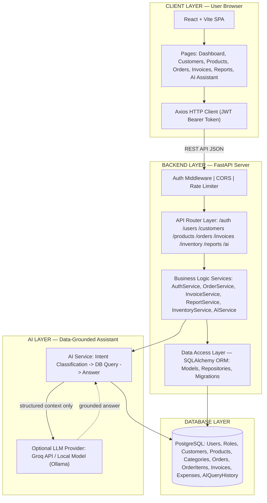
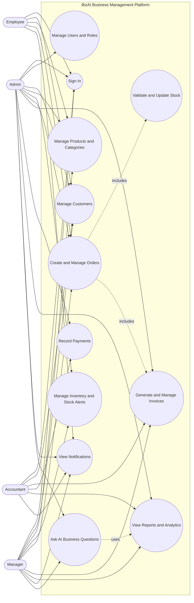
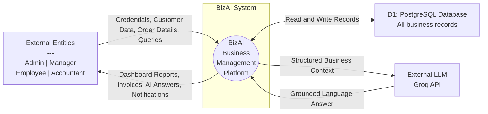
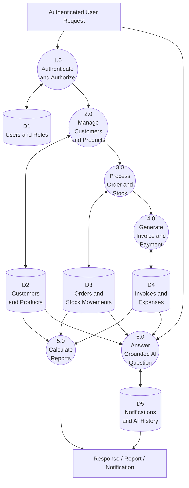
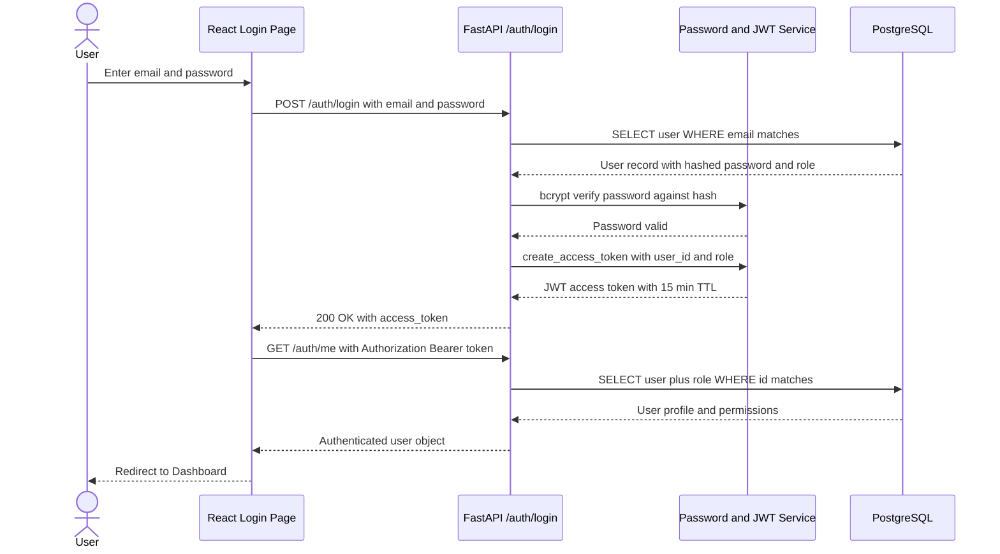
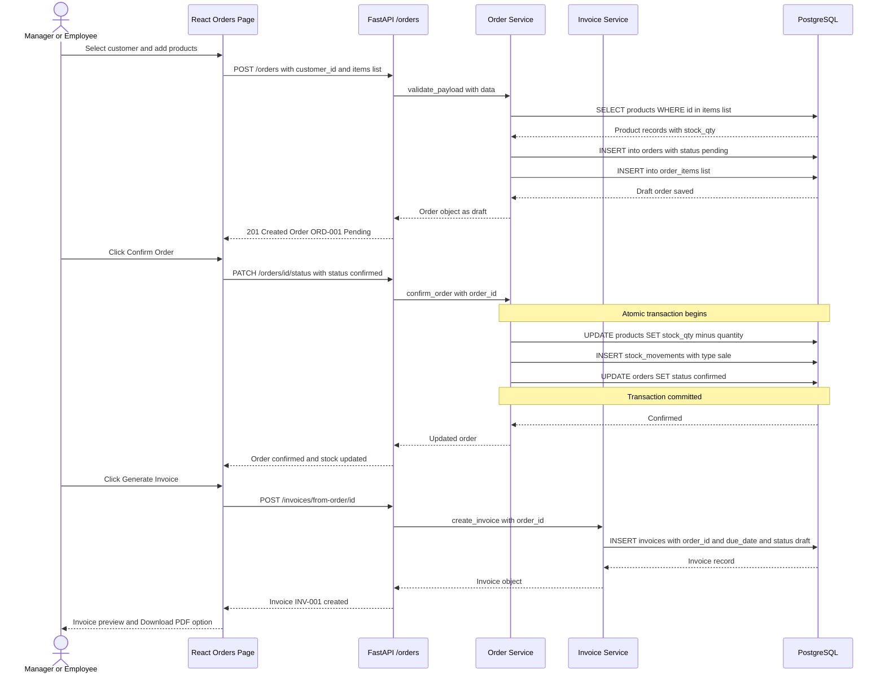
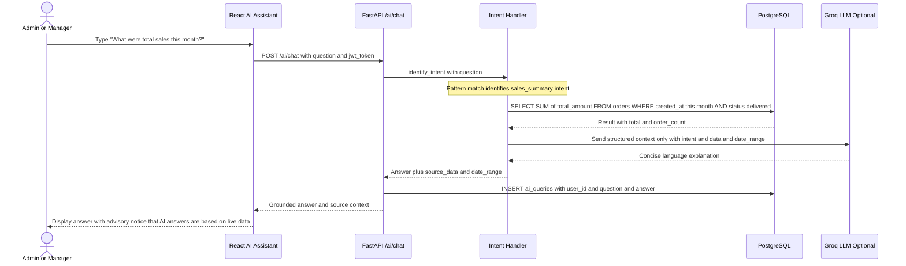
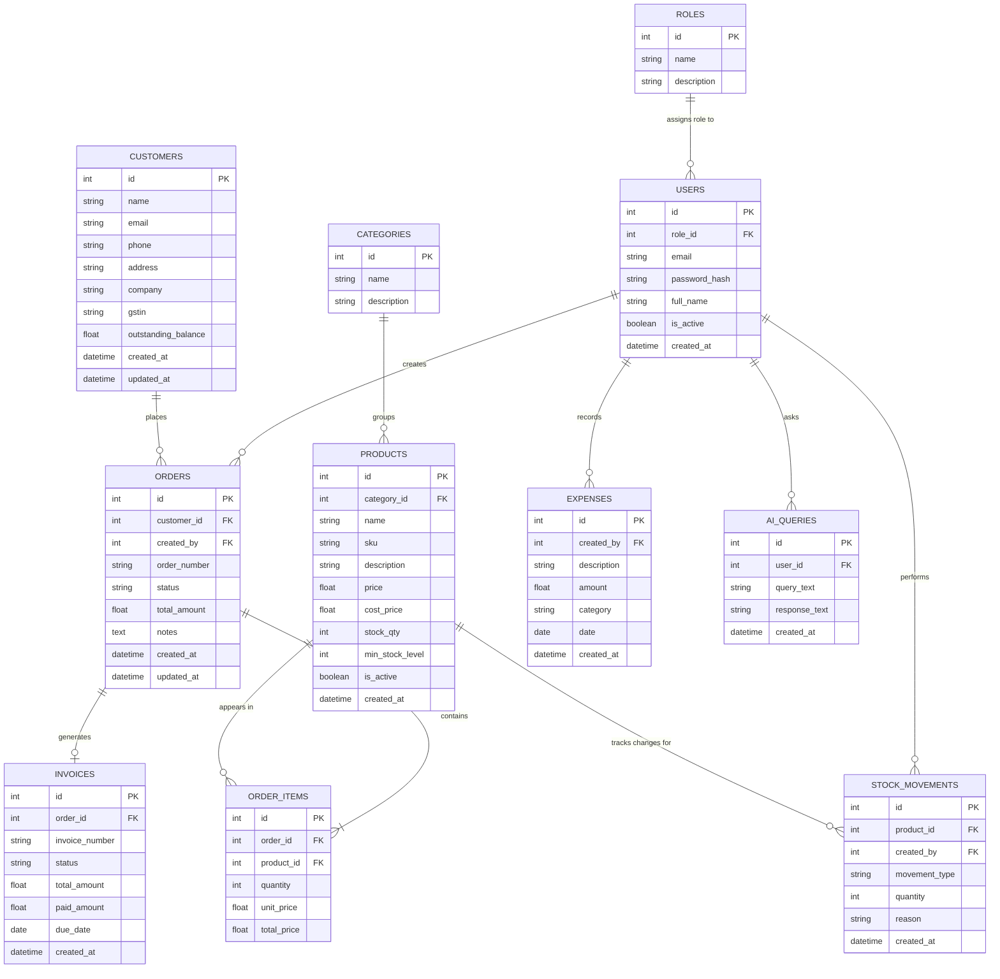
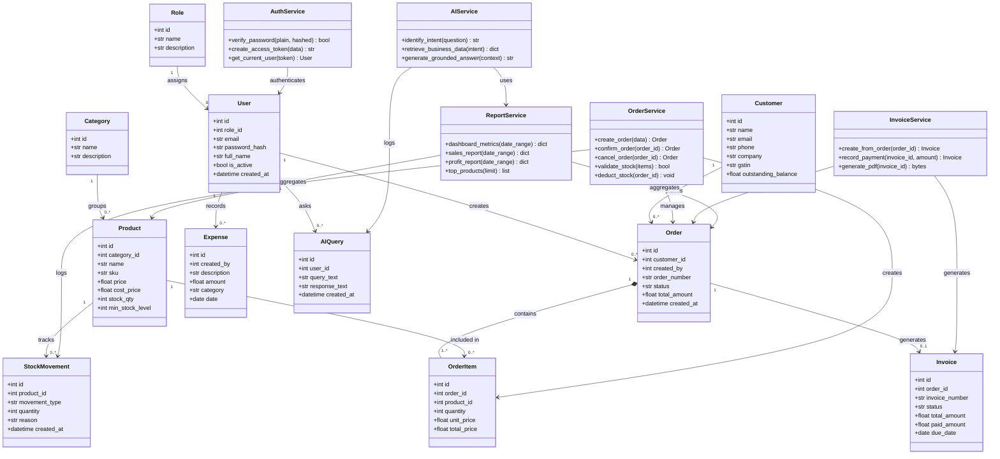

# BizAI — Complete Design Diagram Pack
**Team YATRI | Software Engineering Project**
**AI-Powered Business Management Platform**

> All diagrams below are in Mermaid syntax. Paste each block into [mermaid.live](https://mermaid.live) or draw.io's Mermaid import to render and export as PNG/PDF for your presentation.

---

## 1. System Architecture Diagram

> Shows the layered architecture: Browser -> React SPA -> FastAPI -> Services -> PostgreSQL + optional LLM.

---

## 2. Use Case Diagram

> Shows the four user roles (Admin, Manager, Employee, Accountant) and which system features each can access.

---

## 3. Data Flow Diagram — Context Level (Level 0)

> Shows BizAI as a single process, its external entities, and all data flows in and out.

---

## 4. Data Flow Diagram — Level 1 (Detailed)

> Breaks BizAI into its six core processes and shows how data flows between them and the data stores.

---

## 5. Sequence Diagram — User Login and Authentication

> Step-by-step message flow for the login process, from form submission to JWT issuance and dashboard load.

---

## 6. Sequence Diagram — Order Creation, Stock Update, and Invoice Generation

> Shows the full lifecycle of an order: creation -> confirmation (stock deducted) -> invoice generation.

---

## 7. Sequence Diagram — AI Business Query (Grounded RAG-lite)

> Shows how the AI assistant answers a business question without hallucinating by querying the database first.

---

## 8. Database ER Diagram (Entity-Relationship)

> Shows all database tables, their columns, and the relationships between them.

---

## 9. Database Normalization Evidence Table

> Included alongside the ER Diagram to prove the schema meets 1NF, 2NF, and 3NF requirements.

| Table | 1NF | 2NF | 3NF |
|---|---|---|---|
| `users` | Each column stores one atomic value; no repeating groups | Every attribute depends on the primary key id | Role name lives in roles table, not duplicated in users |
| `orders` | One order per row; order items are separated into order_items table | Each attribute depends only on order.id | Customer details stay in customers; creator details in users |
| `order_items` | One product-quantity pair per row | All fields depend on the composite identity of order plus product | Product details like name and price remain in products table |
| `products` | One SKU, price, stock value per row | All attributes depend on product.id | Category name lives in categories, linked via category_id |
| `invoices` | One payment record per row | Invoice attributes depend on invoice.id | Customer data is accessed through the linked orders table |
| `stock_movements` | One stock event per row | Event attributes depend on movement.id | Product and user details remain in their own source tables |

> Denormalization note: total_amount in orders and invoices is a maintained aggregate. This is intentional and justified because it is always recalculated from line items on insert/update and is required for invoice document stability and fast reporting queries.

---

## 10. UML Class Diagram (Code Modules)

> Shows the main Python classes (SQLAlchemy models, service classes, routers) and their relationships.

---

*All diagrams created for BizAI — Team YATRI, Software Engineering Project 2026.*
*Paste Mermaid blocks into https://mermaid.live or import into draw.io for final rendering and export.*
