# BizAI — Design Diagram Pack
**Team YATRI | BizAI: AI-Powered Business Management Platform**

Diagrams are organised exactly as Sir specified:
- **Section 1:** Architectural Diagram + Use Cases
- **Section 2:** Data Flow Diagram (DFD) + Sequence Diagrams (one per action flow)
- **Section 3:** Database Design — ER Diagram, RDBMS Schema Table, Normal Forms
- **Section 4:** Class Diagrams (UML) for Code Modules

> Paste any Mermaid block into **https://mermaid.live** → render → Export PNG/SVG for submission.

---

# SECTION 1 — ARCHITECTURAL DIAGRAM & USE CASES

---

## 1.1 System Architecture Diagram

Shows the four physical layers of BizAI and how they are connected.

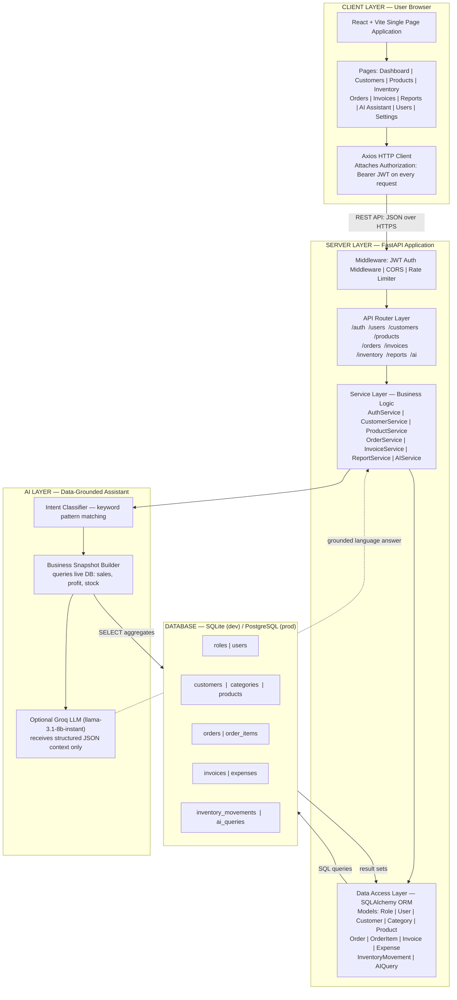

---

## 1.2 Use Case Diagram

Shows all four user roles and every system feature each role is authorised to access.

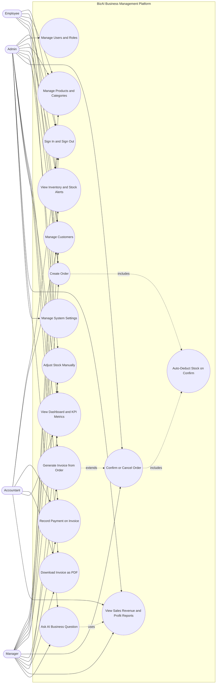

---

# SECTION 2 — DATA FLOW DIAGRAM & SEQUENCE DIAGRAMS

---

## 2.1 DFD — Level 0 Context Diagram

Treats BizAI as one black-box process. Shows all external actors and every data flow crossing the system boundary.

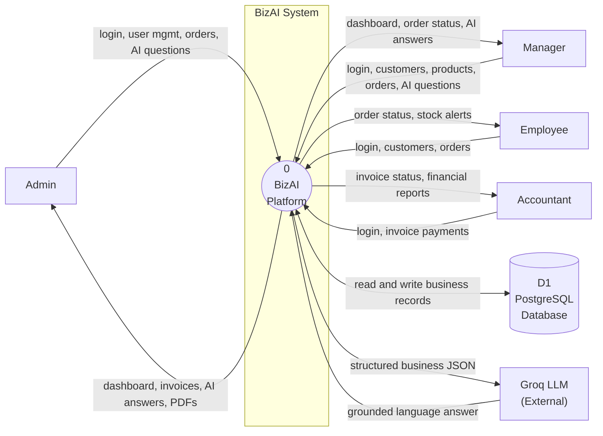

---

## 2.2 DFD — Level 1 Detailed Internal Processes

Expands BizAI into six internal processes and five data stores, showing all internal data flows.

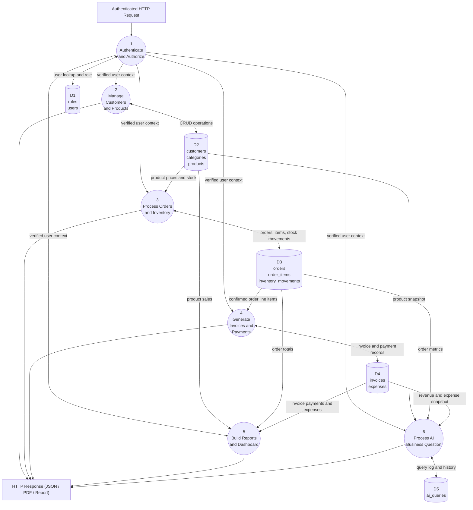

---

## 2.3 Sequence Diagram — User Login and Authentication

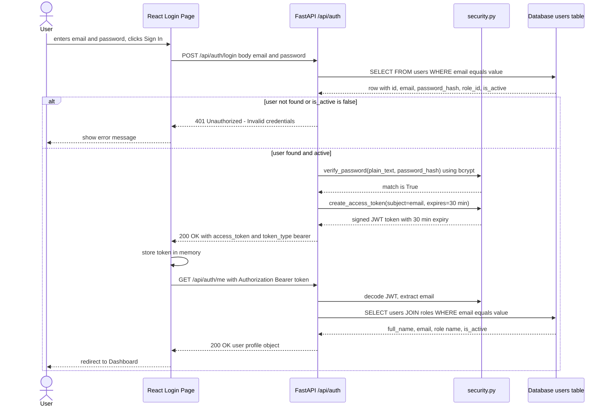

---

## 2.4 Sequence Diagram — Create and Confirm Order with Stock Deduction

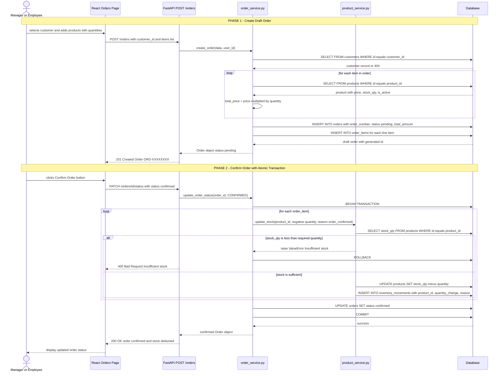

---

## 2.5 Sequence Diagram — Generate Invoice and Record Payment

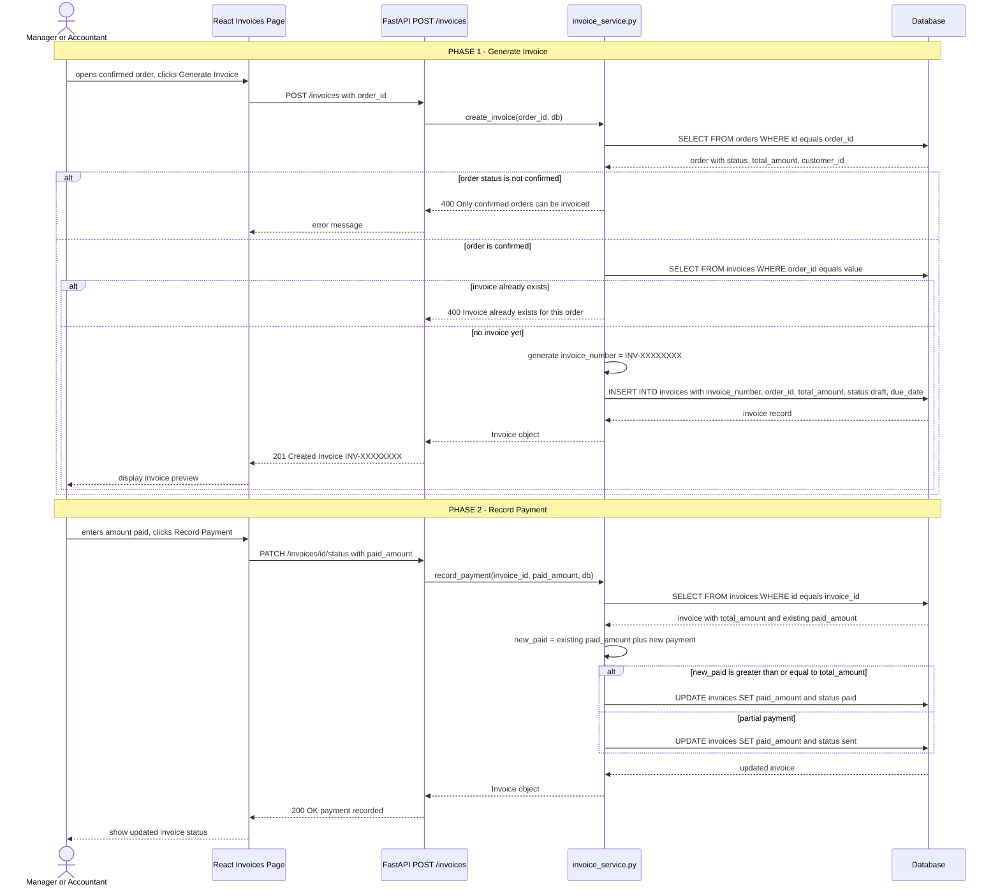

---

## 2.6 Sequence Diagram — AI Business Question (Grounded RAG)

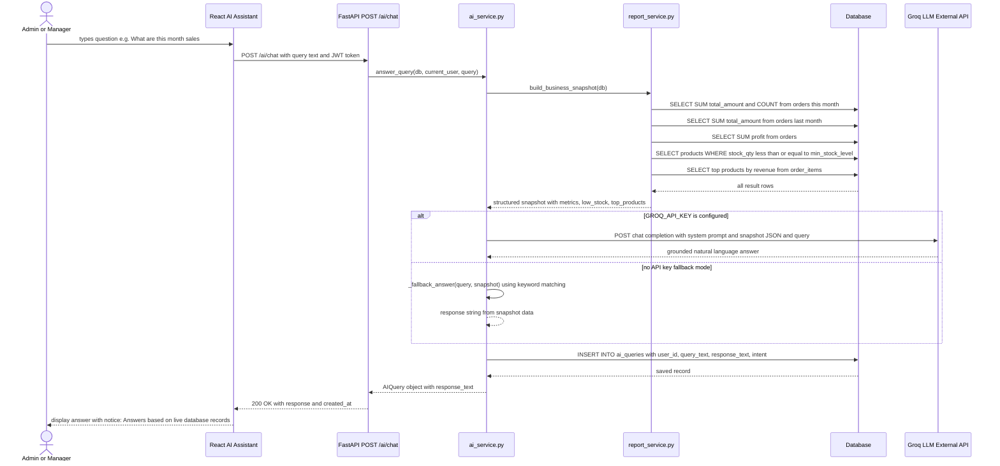

---

## 2.7 Sequence Diagram — Manual Inventory Stock Adjustment

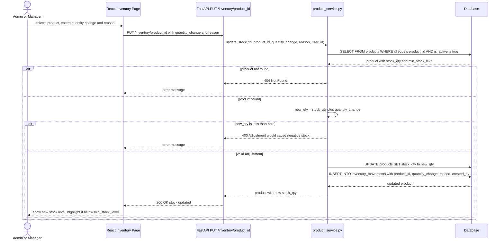

---

# SECTION 3 — DATABASE DESIGN DIAGRAMS

---

## 3.1 ER Diagram — Entity Relationship Diagram

Shows all 11 tables, every column with data type and constraint, and all relationships with cardinality.

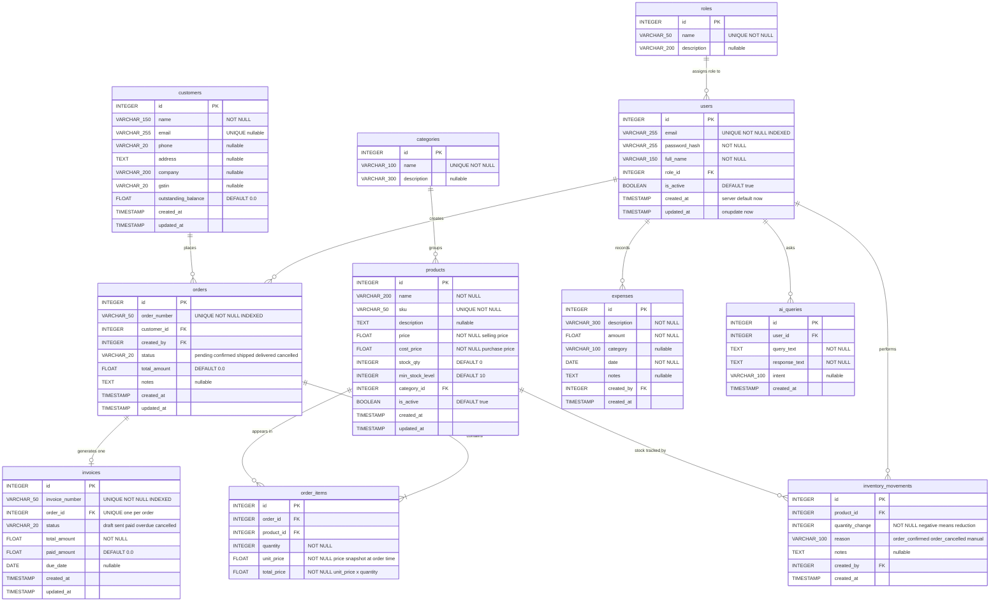

---

## 3.2 RDBMS Schema Table (Physical Database Design)

| Table | Column | Data Type | Constraint |
|---|---|---|---|
| **roles** | id | INTEGER | PRIMARY KEY |
| | name | VARCHAR(50) | UNIQUE, NOT NULL |
| | description | VARCHAR(200) | NULLABLE |
| **users** | id | INTEGER | PRIMARY KEY |
| | email | VARCHAR(255) | UNIQUE, NOT NULL, INDEXED |
| | password_hash | VARCHAR(255) | NOT NULL |
| | full_name | VARCHAR(150) | NOT NULL |
| | role_id | INTEGER | FK → roles.id, NOT NULL |
| | is_active | BOOLEAN | DEFAULT TRUE |
| | created_at | TIMESTAMP | server_default = NOW() |
| | updated_at | TIMESTAMP | onupdate = NOW() |
| **customers** | id | INTEGER | PRIMARY KEY |
| | name | VARCHAR(150) | NOT NULL |
| | email | VARCHAR(255) | UNIQUE, NULLABLE |
| | phone | VARCHAR(20) | NULLABLE |
| | address | TEXT | NULLABLE |
| | company | VARCHAR(200) | NULLABLE |
| | gstin | VARCHAR(20) | NULLABLE |
| | outstanding_balance | FLOAT | DEFAULT 0.0 |
| | created_at / updated_at | TIMESTAMP | auto-managed |
| **categories** | id | INTEGER | PRIMARY KEY |
| | name | VARCHAR(100) | UNIQUE, NOT NULL |
| | description | VARCHAR(300) | NULLABLE |
| **products** | id | INTEGER | PRIMARY KEY |
| | name | VARCHAR(200) | NOT NULL |
| | sku | VARCHAR(50) | UNIQUE, NOT NULL |
| | description | TEXT | NULLABLE |
| | price | FLOAT | NOT NULL (selling price) |
| | cost_price | FLOAT | NOT NULL (purchase price) |
| | stock_qty | INTEGER | DEFAULT 0 |
| | min_stock_level | INTEGER | DEFAULT 10 |
| | category_id | INTEGER | FK → categories.id, NULLABLE |
| | is_active | BOOLEAN | DEFAULT TRUE |
| | created_at / updated_at | TIMESTAMP | auto-managed |
| **orders** | id | INTEGER | PRIMARY KEY |
| | order_number | VARCHAR(50) | UNIQUE, NOT NULL, INDEXED |
| | customer_id | INTEGER | FK → customers.id, NOT NULL |
| | created_by | INTEGER | FK → users.id, NOT NULL |
| | status | VARCHAR(20) | pending/confirmed/shipped/delivered/cancelled |
| | total_amount | FLOAT | DEFAULT 0.0 |
| | notes | TEXT | NULLABLE |
| | created_at / updated_at | TIMESTAMP | auto-managed |
| **order_items** | id | INTEGER | PRIMARY KEY |
| | order_id | INTEGER | FK → orders.id, CASCADE DELETE |
| | product_id | INTEGER | FK → products.id, NOT NULL |
| | quantity | INTEGER | NOT NULL |
| | unit_price | FLOAT | NOT NULL (price snapshot at time of order) |
| | total_price | FLOAT | NOT NULL (unit_price × quantity) |
| **invoices** | id | INTEGER | PRIMARY KEY |
| | invoice_number | VARCHAR(50) | UNIQUE, NOT NULL, INDEXED |
| | order_id | INTEGER | FK → orders.id, UNIQUE (one invoice per order) |
| | status | VARCHAR(20) | draft/sent/paid/overdue/cancelled |
| | total_amount | FLOAT | NOT NULL |
| | paid_amount | FLOAT | DEFAULT 0.0 |
| | due_date | DATE | NULLABLE |
| | created_at / updated_at | TIMESTAMP | auto-managed |
| **expenses** | id | INTEGER | PRIMARY KEY |
| | description | VARCHAR(300) | NOT NULL |
| | amount | FLOAT | NOT NULL |
| | category | VARCHAR(100) | NULLABLE |
| | date | DATE | NOT NULL |
| | notes | TEXT | NULLABLE |
| | created_by | INTEGER | FK → users.id, NOT NULL |
| | created_at | TIMESTAMP | auto-managed |
| **inventory_movements** | id | INTEGER | PRIMARY KEY |
| | product_id | INTEGER | FK → products.id, NOT NULL |
| | quantity_change | INTEGER | NOT NULL (negative = stock reduction) |
| | reason | VARCHAR(100) | order_confirmed / order_cancelled / manual |
| | notes | TEXT | NULLABLE |
| | created_by | INTEGER | FK → users.id, NULLABLE |
| | created_at | TIMESTAMP | auto-managed |
| **ai_queries** | id | INTEGER | PRIMARY KEY |
| | user_id | INTEGER | FK → users.id, NOT NULL |
| | query_text | TEXT | NOT NULL |
| | response_text | TEXT | NOT NULL |
| | intent | VARCHAR(100) | NULLABLE |
| | created_at | TIMESTAMP | auto-managed |

---

## 3.3 Normal Form Evidence Table

| Table | 1NF | 2NF | 3NF |
|---|---|---|---|
| **orders** | Each column holds one atomic value. Line items are in order_items — no repeating groups in orders. | All non-key columns (status, total_amount, notes) depend only on orders.id. No partial dependencies. | Customer name is not in orders — accessed via customer_id FK. User details via created_by FK. No transitive dependencies. |
| **order_items** | One product-quantity pair per row. No arrays or lists. | quantity, unit_price, total_price all depend fully on the identity {order_id, product_id}. | unit_price is a price snapshot stored at order time. Product details (name, current price) live in products. No transitive dep. |
| **products** | Each column holds one value: one price, one SKU, one stock count. | All attributes depend solely on products.id. | category name lives in categories, referenced by category_id FK. No non-key attribute depends on another. |
| **invoices** | One payment record per row. balance_due is a computed property — not a stored column. | invoice_number, total_amount, paid_amount, status all depend on invoices.id. | Customer/order data is accessed through order_id FK — not duplicated inside invoices. |
| **inventory_movements** | One stock-change event per row with a single quantity_change. | quantity_change, reason, notes all depend only on inventory_movements.id. | Product info remains in products; user info remains in users. No transitive dependency in this table. |
| **users** | One user per row. Role is referenced by role_id, not stored as text. | All user attributes depend only on users.id. | Role name and description live in roles table, not in users. |
| **expenses** | One expense per row with atomic amount and date. | All attributes depend only on expenses.id. | Created-by user details remain in users, referenced by FK. |

> **Denormalisation note:** total_amount in orders and invoices is a calculated aggregate stored as a column. This is a deliberate and justified engineering decision — the value is always recalculated fresh on insert/update from order_items, and is required for invoice document stability (product prices can change after the order is placed) and for fast report aggregations without joining order_items on every dashboard query.

---

# SECTION 4 — CLASS DIAGRAMS (UML)

---

## 4.1 UML Class Diagram — Data Model Classes

All 11 SQLAlchemy ORM model classes with exact attributes (from /backend/models/) and relationships.

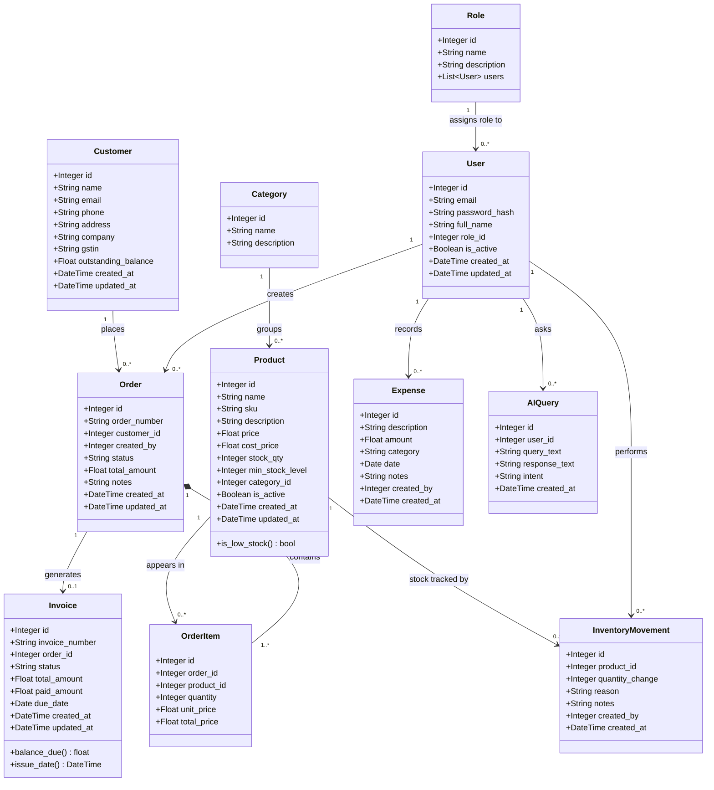

---

## 4.2 UML Class Diagram — Service Layer (Business Logic)

All service classes with their public methods and dependencies on model classes.

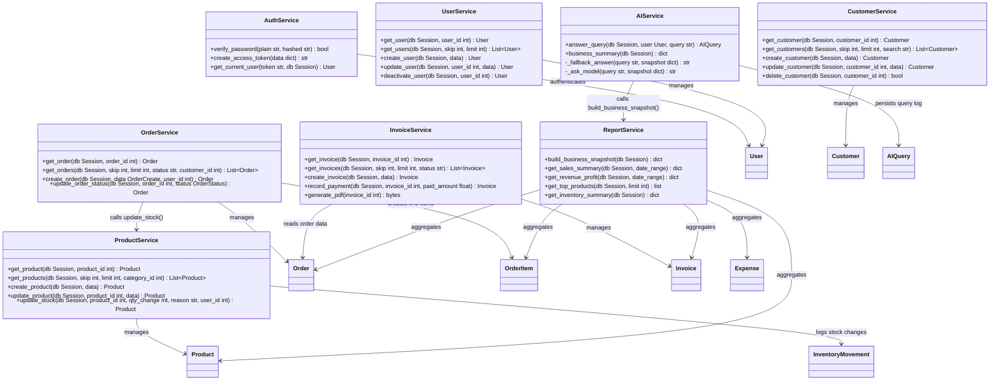

---

*BizAI — Team YATRI | Software Engineering Project 2026*
*All diagrams derived directly from /backend/models/ and /backend/services/ source files.*
*Render at https://mermaid.live — Export PNG/SVG for submission to Sir.*
